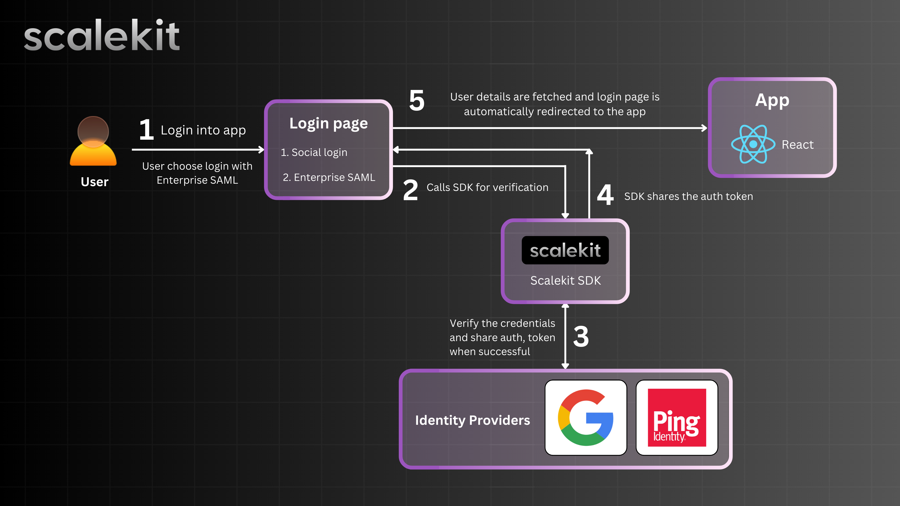

# Node.js with React Tutorial: Single Sign-On (SSO) with Ping Identity

This project enables **Single Sign-On (SSO) authentication** using **Ping Identity**, allowing users to securely access multiple applications with a single login. It integrates a **React.js frontend** for user authentication and a **Node.js backend** for handling authentication requests and token validation.

## Project Overview

This project provides a complete **Single Sign-On (SSO) authentication system** using **Ping Identity** as the Identity Provider (IdP). It consists of:

- **Frontend (React.js)**: A user-friendly login interface that allows users to authenticate using **Social Login (Google, Ping Identity)** or **Enterprise SAML**. Runs on **port 3000**.
- **Backend (Node.js)**: Handles authentication requests, integrates with Ping Identity, and processes user authentication tokens securely. Runs on **port 3001**.

By following this guide, you will set up an end-to-end authentication flow where users can sign in once and access multiple applications securely using **SSO with Ping Identity**.



## How It Works

### **1. User Login**
   - The user accesses the application and selects **Social Login (Google, Ping Identity)** or **Enterprise SAML**.

### **2. Authentication Request**
   - The **frontend** sends a login request to the **Node.js backend**, which redirects the user to **Ping Identity** for authentication.

### **3. Identity Verification with MFA**
   - Ping Identity authenticates the user by verifying their **username and password**.
   - The system then prompts the user for **Multi-Factor Authentication (MFA)** to enhance security.
   - The user enters the **MFA code** received via their chosen method (e.g., SMS, authenticator app).

### **4. Token Validation & Session Creation**
   - After successful authentication, Ping Identity returns a **secure authentication token**.
   - The **backend validates** the token using the **Scalekit SDK**, verifies user permissions, and creates a session.

### **5. Access Granted**
   - The user is redirected to the application with **SSO-enabled access** to all linked services.

By implementing this process, the project ensures a **secure, scalable, and seamless** SSO experience, making authentication easier and more efficient.

## Prerequisites

If Node.js and npm are not installed, download and install them from [Node.js official website](https://nodejs.org/).
Ensure that you have **Node.js** and **npm** installed on your system. You can verify the installation using the following commands:

```sh
node -v && npm -v
```

## Technology Stack

- **React.js**: Frontend framework for building the user authentication interface.
- **Node.js & Express**: Backend server for processing authentication requests.
- **Ping Identity**: Identity Provider (IdP) that manages user authentication and token issuance.
- **SAML & OAuth2**: Authentication protocols for secure user login and token validation.
- **Scalekit SDK**: Facilitates secure integration between the application and Ping Identity.

## Setup Instructions

### **Clone the Repository**

```sh
git clone git@github.com:saif-at-scalekit/authn-examples.git && cd scalekit-examples-ping-indentity
```

### **Follow these steps to set up the server:**

### 1. Set up the environment:

```sh
cp backend/.env.example backend/.env
```

Add the following credentials in the `.env` file:

```sh
SCALEKIT_ENVIRONMENT_URL=
SCALEKIT_CLIENT_ID=
SCALEKIT_CLIENT_SECRET=
```

### 2. Install the dependencies and start the servers:

```sh
npm run install-all && npm start
```

## **Running the Project**

Once both the frontend and backend are running:

1. Open http://localhost:3000 in your browser.
2. Click on **Social Login** or **Enterprise SAML**.
3. You'll be redirected to **Ping Identity** for authentication.
4. After entering your **username and password**, the system will prompt for **MFA verification**.
5. Enter the **MFA code** received via your authentication method.
6. Once verified, **Scalekit** processes the authentication token and redirects you to the main application with **SSO-enabled access**.
